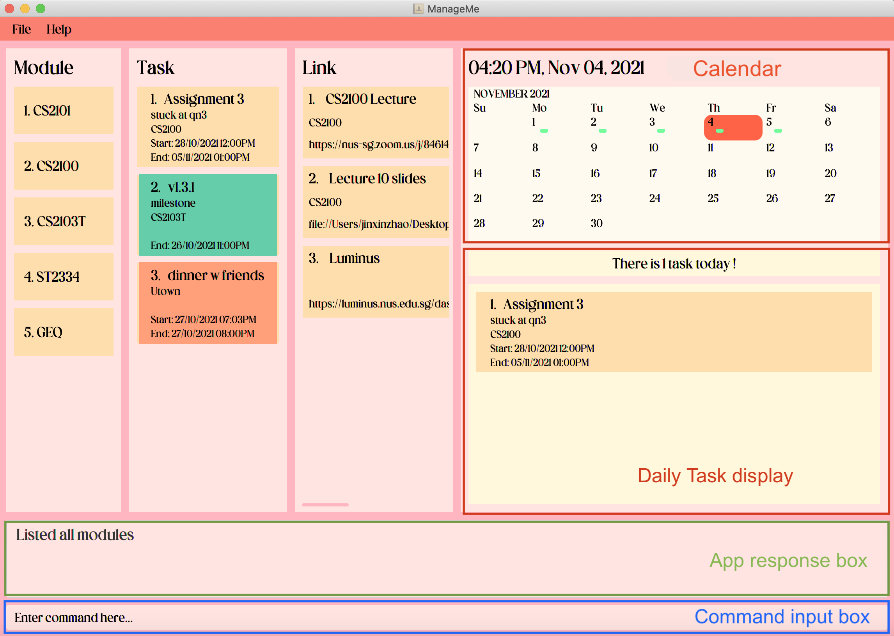
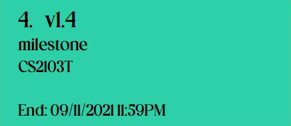
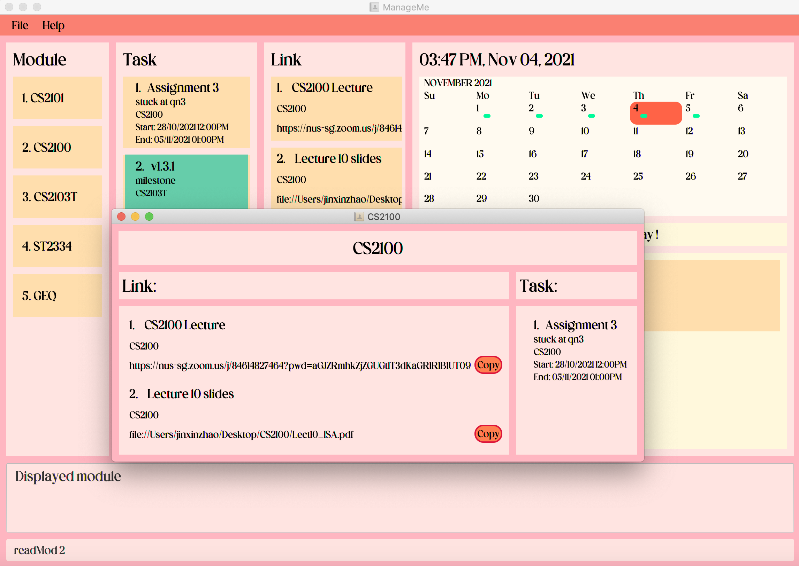
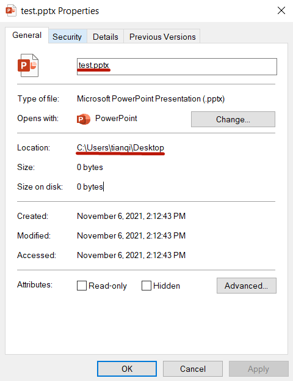
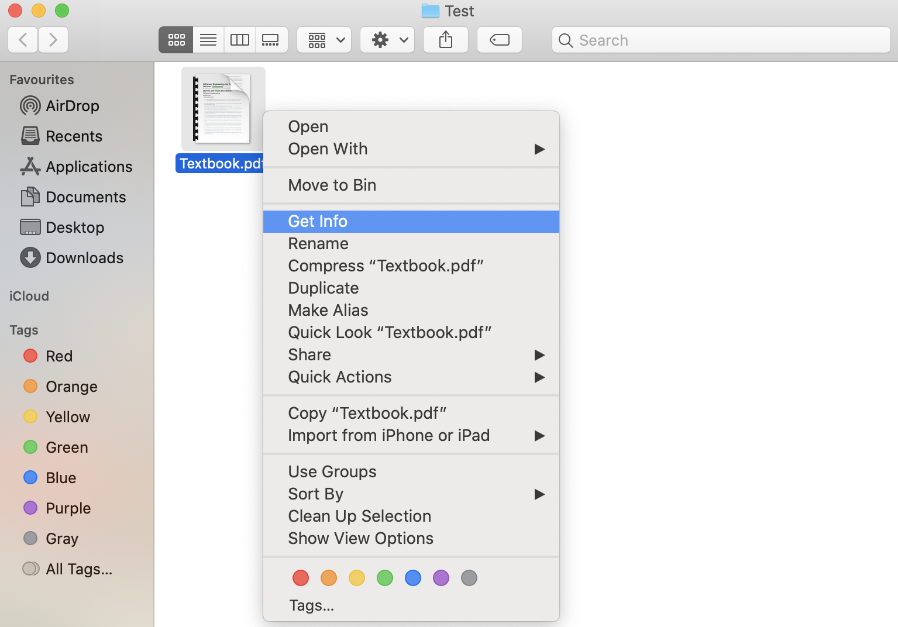
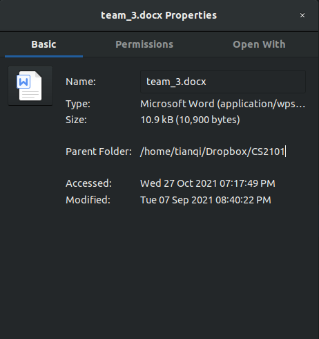
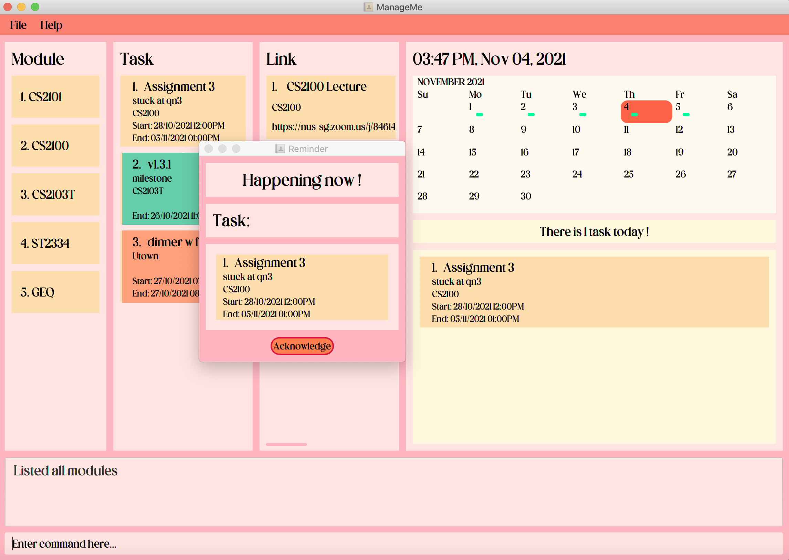

## Table of Contents
* table-of-contents
{:toc}

--------------------------------------------------------------------------------------------------------------------

## Introduction
ManageMe is a **lightweight but powerful** desktop application built to **help university students manage their school life**, available on Windows, Linux, and Mac. If you are a University student struggling to cope with your ever-increasing workload, then ManageMe is for you!

You can add your modules, tasks, schedules, and online learning resources easily into ManageMe and access them with simple commands. The application is optimized for interaction through typing with a text input and response box similar to a **Command Line Interface (CLI)** but also provides a convenient Graphical User Interface (GUI) for more visual users.

This user guide will give you a comprehensive understanding of using ManageMe to its full potential. Begin your journey with the [Quick Start](#quick-start) section. For a full overview of the user guide, check out the [Table of Contents](#table-of-contents).
  

--------------------------------------------------------------------------------------------------------------------
## How to navigate this User Guide

Better add this in. Include things like the information icon, or perhaps shift the note in Features here.

--------------------------------------------------------------------------------------------------------------------

## Quick Start
This section aims to provide a quick introduction to using ManageMe.
It should take **less than 5 minutes to read** and will provide new users with the necessary knowledge to install and start using the application.

### Steps for installation
1. Ensure you have Java 11 or above installed on your computer.
2. [Download](https://github.com/AY2122S1-CS2103T-W11-3/tp/releases) the latest jar release of ManageMe.
3. Open your browser's download folder and locate the downloaded jar file. ManageMe can run on multiple platforms, including Windows, Mac, and Linux.
4. Move the jar file into your desired folder. ManageMe will use this folder to store its data by default.
5. Start the app by double-clicking on the jar file, or if you are using the command line, type `java -jar manageme.jar`.
6. Enjoy using the application!

### User Interface
Below is a screenshot of our User Interface (UI). As you can see, there are management panels for Modules, Tasks, Calendar, and Links.
You can type command lines in the command input box, and the ManageMe's response will be shown in the app response box.
 

 *Homepage of Application*

### Example commands

These are some commands that you can try immediately:

* `addMod n/CS3230`: Adds a module named "CS3230".
* `deleteTask 1`: Deletes the 1st task shown in the current list.
* `editLink 3 n/CS2100 Exam Link`: Edits the name of the 3rd link shown in the current list to “CS2100 Exam Link”.
* `clear`: Deletes all modules, tasks, and links in ManageMe. Use this command to reset ManageMe.
* `exit`: Exits the application.

Simply type one of them into the command box and press Enter to execute it.

Refer to [Features](#features) below for details of each command.
  

Return to [Table of Contents](#table-of-contents).

--------------------------------------------------------------------------------------------------------------------

## Features
This section gives a full list of all the application's features with details on how to use them, paired with some examples.
There will also be tips along the way to ensure a greater user experience for you.

**:information_source: Notes about the command format:** 

* Words in `UPPER_CASE` are the parameters to be supplied by the user. E.g. `addTask n/TASK_NAME`, here `TASK_NAME` is the parameter. 

* Items in square brackets are optional. E.g. `addTask n/TASK_NAME [mod/ASSOCIATED_MODULE_NAME]`, here `mod/ASSOCIATED_MODULE_NAME` is an optional item and does not need to be included in the addTask command. 

### Tasks:

#### Adding a task: `addTask`

Adds a task to the task list.

Format: `addTask n/NAME d/DESCRIPTION [mod/ASSOCIATED_MODULE_NAME] [s/START_DATETIME] [e/END_DATETIME]`
* A **name** and **description** for the task is **compulsory**.
* No duplicate tasks can be added. A task is considered a duplicate if it has the same `NAME` with any existing tasks, even if other attributes are different.
* It is optional to include an associated module name, a start datetime and an end datetime.
* A task created with a start datetime **must** also have an end datetime.
* Format for `START_DATETIME`/`END_DATETIME` is as follows: `yyyy-MM-ddThh:mm` e.g. `2021-10-29T23:59`.
* Take note that the **T** must be in the date that you entered. 
  Example: `e/2021-10-25T16:00`

Example: `addTask n/Do CS2103T Assignment d/Refer to lecture 10 for examples mod/CS2103T s/2021-10-05T11:00 e/2021-10-07T23:59`
  

#### Edit a task: `editTask`
Edit an existing task in the task list.

Format: `editTask INDEX [n/NAME] [d/DESCRIPTION] [mod/ASSOCIATED_MODULE_NAME] [s/START_DATETIME] [e/END_DATETIME]`
* The index refers to the index number shown in the displayed module list.
* The index **must be a positive integer** 1, 2, 3, ...
* At least one of the optional fields must be provided.
* Existing values will be updated to the input values.
* Format for a `DATETIME` is as follows: `yyyy-MM-ddThh:mm` e.g. `2021-10-29T23:59`.
* Take note that the **T** must be in the date that you entered.
  Example: `editTask 10 d/Complete assignments e/2021-10-25T16:00`
    

#### Deleting a task: `deleteTask`
Deletes the specified task from the task list.

Format: `deleteTask INDEX`
* Deletes the task at the specified `INDEX`.
* The index refers to the index number shown in the displayed task list.
* The index **must be a positive integer** 1, 2, 3, ...

Example: `deleteTask 2`
 

**:warning: Caution** 

* Deleting a task is irreversible. 

 

#### Find a task by keyword: `findTask`
Finds all tasks whose names contain any of the specified keywords.

Format: `findTask KEYWORD [MORE_KEYWORDS]`
* The search is **case-insensitive**. e.g "lecture" will match "Lecture".
* The order of the keywords does not matter. e.g. "Slide Lecture" will match "Lecture Slide".
* Only the name is searched.
* Partial words will be matched e.g. "Assign" will match "Assignments".
* Tasks matching at least one keyword will be returned (i.e. OR search).

Example: `findTask assignment`   
Before findTask:  
  

After findTask:  

  

#### List all tasks : `listTask`
Display all tasks.  
This command is used to return to the full list of tasks after searching for specific tasks.

Format: `listTask`
  

#### Mark a task as done or undone: `markTask`
Marks the specified task from the task list as done or undone. Marking a task that is done will change it to undone while marking a task that is not done will change it to done.

Format: `markTask INDEX`
- Marks the task at the specified `INDEX`.
- The index refers to the index number shown in the displayed task list.
- The index **must be a positive integer** 1, 2, 3, ...

Example: `markTask 2`

 
*An ongoing task not yet done will be in the default colour*
  

 
*A task marked as done will be coloured green.*
  

#### Delete all done tasks: `deleteDoneTask`
Deletes **all** tasks that have been marked as done from the task list.

Format: `deleteDoneTask`

**:warning: Caution** 

* Deleting a task that is marked as done is irreversible. 

Return to [Table of Contents](#table-of-contents).

### Modules:
#### Adding a module: `addMod`
Adds a module into the module list.

Format: `addMod n/NAME`  
* No duplicate modules can be added. A module is considered a duplicate if it has the same `NAME` with any existing modules.

Examples: `addMod n/CS2103`
  

#### Read details of a module: `readMod`
View module in detail. Creates a pop-up window to show the course name, link, and all the tasks associated with the module.

Format: `readMod INDEX` 
* The index refers to the index number shown in the displayed module list.
* The index **must be a positive integer** 1, 2, 3, ...

Examples: `readMod 2`

*Pop-up window for readMod*
  

#### Edit a module: `editMod`
Edits an existing module in the module list.

Format: `editMod INDEX n/NAME`
* Edits the mod by the specified `INDEX`. 
* The index refers to the index number shown in the displayed module list.
* The index **must be a positive integer** 1, 2, 3, ...
* Existing values will be updated to the input values.

Example: `editMod 2 n/CS3230`
  

#### Delete a module: `deleteMod`
Deletes the specified module from the module list.

Format: `deleteMod INDEX`
* Deletes the mod by the specified `INDEX`.
* The index refers to the index number shown in the displayed module list.
* The index **must be a positive integer** 1, 2, 3, ...

Example: `deleteMod 2`
  

**:warning: Caution** 

* Deleting a module is irreversible. 

#### Find a module by keyword: `findMod`
Finds all modules whose names contain any of the specified keywords.

Format: `findMod KEYWORD [MORE_KEYWORDS]`

* The search is **case-insensitive**. e.g "cs2100" will match "CS2100".
* The order of the keywords does not matter. e.g. "Communication Effective" will match "Effective Communication".
* Only the name is searched.
* Partial words will be matched e.g. "CS210" will match "CS2101".
* Modules matching at least one keyword will be returned (i.e. OR search).

Example: `findMod computer` returns `Computer Organization` and `Computer Architecture`
  

#### List all modules: `listMod`
Displays the full module list. This command is used to return to the full list
of modules after searching for specific modules.

Format: `listMod`
  

Return to [Table of Contents](#table-of-contents).

### Links:
#### Add a link: `addLink`
Adds a link into the link list. A link contains its name and a website link for online learning.

Format: `addLink n/NAME a/LINK_ADDRESS [mod/ASSOCIATED_MODULE_NAME]`  
* A link can be a url to a webpage or a file path.
* No duplicate links can be added. A link is considered a duplicate if it has the same `NAME` **and** `ADDRESS` with any existing links. 
  In this way, you can name multiple links the same as e.g. "Lecture", "Tutorial" etc, but associate them with different mods.
* A link should be in a valid uri format, beginning with https://, ftp:// of file:/ .
* After tagging the module, the link will appear in the readMod panel of the particular module.
* No space is allowed in the webpage address or file path.
* A file path should be an **absolute directory** with file:// at the front, and `/` to separate subdirectories. For example, if you are using windows, and a document is at `Documents/doc.docx`, you may need to type `file://C:/users/YOUR_USERNAME/Documents/doc.docs` for our app to recognize your file directory properly.

Examples: `addLink n/Yahoo a/https://www.yahoo.com`

:bulb: **Tip: How to find the absolute directory of my file?**   

**For windows:** right-click on the file, select `properties`, and you will see a window like this.  
   

Under the `general` panel, there will be the `name` of the file and its `Location`. The absolute directory is the combination of the two.
Our app take the format with slash instead of backslash like the location in the picture, so you may also need to change all the backslashes into slasheas.   
For this example, the absolute directory with slashes is `C:/Users/tianqi/Desktop/test.pptx`. You may type `addLink n/test a/C:/Users/tianqi/Desktop/test.pptx` into our app to add the link.   

**For Mac:** Right click on the file, select “Get Info”:  
  

Then you will see this window. Copy and paste the “path” section:  
  

**For Linux**, take ubuntu as an example. Like windows, you may right-click on the file and see the path of the parent folder and the file name.   
  

#### Edit a link: `editLink`
Edits an existing link in the link list.

Format: `editLink INDEX [n/NAME] [a/LINK_ADDRESS] [mod/ASSOCIATED_MODULE_NAME]`
* Edits the link by the specified `INDEX`. 
* The index refers to the index number shown in the displayed link list.
* The index **must be a positive integer** 1, 2, 3, ...
* At least one of the optional fields must be provided.
* Existing values will be updated to the input values.

Example: `editLink 5 n/Amazon a/https://www.amazon.com`
  

#### Delete a link: `deleteLink`
Deletes the specified link from the link list.

Format: `deleteLink INDEX`
* Deletes the mod by the specified `INDEX`.
* The index refers to the index number shown in the displayed link list.
* The index **must be a positive integer** 1, 2, 3, ...

Example: `deleteLink 2`
  

**:warning: Caution** 

* Deleting a Link is irreversible. 

#### Open a link: `openLink`
Opens the link identified by the index in the link list.

Format: `openLink INDEX`
* If it is a link for a webpage, it will open the link in a browser. If it is a file path on your computer, it will open the file using the default application.
* The index refers to the index number shown in the displayed link list.
* The index **must be a positive integer** 1, 2, 3, ...

Example: `openLink 1`
  

#### Find a link by keyword: `findLink`
Finds all links whose name contain the specified keyword.

Format: `findLink KEYWORD [MORE_KEYWORDS]`

* The search is **case-insensitive**. e.g "zoom" will match "Zoom".
* The order of the keywords does not matter. e.g. "Link Exam" will match "Exam Link".
* Only the name is searched.
* Partial words will be matched e.g. "You" will match "Youtube".
* Links with a name matching at least one keyword will be returned (i.e. OR search).

Example: `findLink cs2100` returns `CS2100 Lecture`
  

#### List all links: `listLink`
Display the full list of links. This command is used to return to the full list after searching for specific links.

Format: `listLink`
  

Return to [Table of Contents](#table-of-contents).

### Calendar:
#### Change calendar to next month: `nextMonth`
Display the calendar for the next month. This command will
update the entire calendar panel to display the calendar and the related task information for the following month.

Format: `nextMonth`
  

#### Change calendar to previous month: `prevMonth`
Similar to `nextMonth`. However, this command displays the calendar for the previous month instead.

Format: `prevMonth`
  

#### Read details happening on a day: `readDay`
View a day in detail. Tasks happening on the specified date will be displayed.

Format: `readDay DATE`
* `DATE` given must be a valid date.
* Format for a `DATE` is as follows: `year-month-day` e.g. `2021-10-19`.

Example: `readDay 2021-10-19`
  

Return to [Table of Contents](#table-of-contents).

### Others:

#### Reminders

A reminder will pop up when a task is happening: 
To close the reminder, press Enter or click on the Acknowledge button. Simply closing the window will not work and will cause the reminder to pop up again! 

*Pop-up reminder for tasks*

#### Overdue tasks

Tasks that are overdue(past the end time) will automatically be colored red for users to clearly see which tasks are
overdue.

 
*A Task is coloured red since it is overdue*
 

#### Reset ManageMe: `clear`

Resets the application data. After you are familiar with the various commands, this command can be used to clear the sample data, and you can start filling in your own data.   

**:warning: Caution** 

* Clearing ManageMe's data is irreversible. 

#### Viewing help: `help`

Shows the command summary and the URL to the full User Guide.
  

#### Archive current data: `archive`

Saves a copy of the current application data into a timestamped file located in the data folder.
  

#### Exiting the program : `exit`

Terminates the application.
  

#### Saving the data

Data is saved in the hard disk automatically after any command that changes the data. There is no need to save manually.
  

Return to [Table of Contents](#table-of-contents).

--------------------------------------------------------------------------------------------------------------------

## Command summary
This section serves as a quick reference for all the available commands that can be used in the application.

Action | Format, Examples
--------|------------------
**AddTask** | `addTask n/NAME d/DESCRIPTION [mod/ASSOCIATED_MODULE_NAME] [s/START_DATETIME] [e/END_DATETIME]` e.g., `addTask n/Do Assignment d/Read Lecture 7 mod/CS2100 s/2021-10-05T12:00 e/2021-10-07T23:59`
**EditTask** | `editTask INDEX [n/NAME] [d/DESCRIPTION] [mod/ASSOCIATED_MODULE_NAME] [s/START_DATETIME] [e/END_DATETIME]` e.g., `editTask 3 d/start tutorial 3`
**DeleteTask** | `deleteTask INDEX` e.g., `deleteTask 3`
**findTask** | `findTask KEYWORD [MORE_KEYWORDS]` e.g., `findTask cut hair`
**ListTask** | `listTask`
**MarkTask** | `markTask INDEX` e.g., `markTask 1`
**DeleteDoneTask** | `deleteDoneTask`
**AddModule** | `addMod n/NAME` e.g.,`addMod n/MA1101R`
**ReadModule** | `readMod INDEX` e.g., `readMod 2`
**EditModule** | `editMod INDEX [n/NAME]` e.g., `editMod 2 n/CS2103`
**DeleteModule** | `deleteMod INDEX` e.g., `deleteMod 2`
**FindModule** | `findMod KEYWORD [MORE_KEYWORDS]` e.g., `findMod cs`
**ListModule** | `listMod`
**AddLink** | `addLink n/NAME a/LINK_ADDRESS [mod/ASSOCIATED_MODULE_NAME]` e.g., `addLink n/google a/https://www.google.com`
**DeleteLink** | `deleteLink INDEX` e.g., `deleteLink 2`
**EditLink** | `editLink INDEX [n/NAME] [a/LINK_ADDRESS] [mod/ASSOCIATED_MODULE_NAME]` e.g.,`editLink 5 n/Amazon a/https://www.amazon.com`
**OpenLink** | `openLink INDEX`  e.g.,`openLink 1`
**FindLink** | `findLink KEYWORD` e.g.,`findLink google`
**ListLink** | `listLink`
**NextMonth** | `nextMonth`
**PreviousMonth** | `prevMonth`
**ReadDay** | `readDay DATE` e.g., `readDay 2021-10-19`
**Clear** | `clear`
**Help** | `help`
**Archive** | `archive`
**Exit** | `exit`

Return to [Table of Contents](#table-of-contents).
